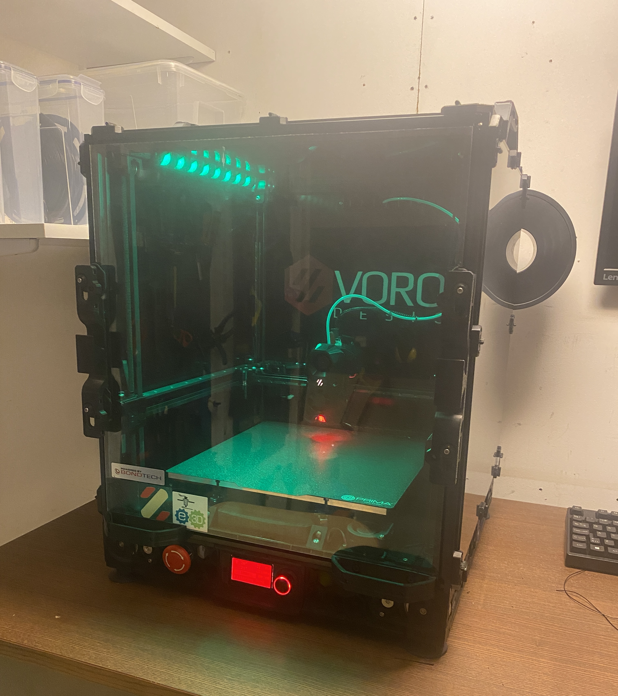

     ██╗   ██╗ ██████╗ ██████╗  ██████╗ ███╗   ██╗
     ██║   ██║██╔═══██╗██╔══██╗██╔═══██╗████╗  ██║
     ██║   ██║██║   ██║██████╔╝██║   ██║██╔██╗ ██║
     ╚██╗ ██╔╝██║   ██║██╔══██╗██║   ██║██║╚██╗██║
      ╚████╔╝ ╚██████╔╝██║  ██║╚██████╔╝██║ ╚████║
       ╚═══╝   ╚═════╝ ╚═╝  ╚═╝ ╚═════╝ ╚═╝  ╚═══╝
                                             
     ██████╗    ██╗ ██████╗ ██╗  ██╗███████╗      
     ╚════██╗  ███║██╔════╝ ██║  ██║██╔════╝      
      █████╔╝  ╚██║███████╗ ███████║███████╗      
     ██╔═══╝    ██║██╔═══██╗╚════██║╚════██║      
     ███████╗██╗██║╚██████╔╝     ██║███████║      
     ╚══════╝╚═╝╚═╝ ╚═════╝      ╚═╝╚══════╝      
                                             

# Config

Klipper configs for V2.1645 (V2.4 300) printer running fluidd and a lot of mods.

Macros and config files are separeted in the folders.

# Main electronics

* SKR 1.4T x2
* Raspberry Pi 3b+ w/ active cooling
* Meanwell RSP-200-24
* Meanwell RS-15-5
* Keenovo silicone ac heater (240mm x 240mm 600W 220V/240V)
* SSR 120/230 V/AC, 10 Ampere
* BIGTREETECH PI TFT50 V2.0

# Mods

* [Bondtech LGX](https://discord.com/channels/460117602945990666/635687829254701107/823946865027317841)
* [BTT PITFT50 v2 Mount](https://github.com/VoronDesign/VoronUsers/tree/master/printer_mods/alanho/BTT_PITFT50_v2_Mount)
* [C920 Mount](https://github.com/VoronDesign/VoronUsers/tree/master/printer_mods/Koios/C920_Mount)
* [chamber thermistor]()
* [Decontaminator Purge Bucket & Nozzle Scrubber](https://github.com/VoronDesign/VoronUsers/tree/master/printer_mods/edwardyeeks/Decontaminator_Purge_Bucket_&_Nozzle_Scrubber)
* [door sealant](https://www.aliexpress.com/item/1005001446848187.html?spm=a2g0s.9042311.0.0.626e4c4dsDj60w)
* [frame thermistor]()
* [Gantry Backing Plates](https://github.com/VoronDesign/VoronUsers/tree/master/printer_mods/whoppingpochard/extrusion_backers)
* [horizontal spool holder](https://github.com/BladeScraper-Designs/VoronUsers/tree/Horizontal-Spool-Holder/printer_mods/BladeScraper-Designs/Horizontal-Spool-Holder)
* [Keystone Jack Universal Skirt Insert](https://github.com/VoronDesign/VoronUsers/tree/master/legacy_printers/printer_mods/bryansj/Keystone_Jack_Universal_Skirt_Insert)
* [klicky probe](https://github.com/jlas1/Klicky-Probe)
* [LED mounts](https://discord.com/channels/460117602945990666/635687829254701107/725391527882260563)
* [MarcPot Skirt Mods](https://github.com/VoronDesign/VoronUsers/tree/master/printer_mods/MarcPot/Skirt_Mods)
* [nevermore v5 duo](https://github.com/nevermore3d/Nevermore_Micro/tree/master/V5_Duo/V2)
* [outside thermistor]()
* [removable doors](https://github.com/VoronDesign/VoronUsers/tree/master/printer_mods/ElPoPo/RemovableDoors)
* [Sturdy handles](https://github.com/VoronDesign/VoronUsers/tree/master/printer_mods/jeoje/Sturdy_Handles)
* [V2 Bed Wagos](https://github.com/VoronDesign/VoronUsers/tree/master/printer_mods/deepfriedheroin/v2_bed_wagos)
* [VEFACH](https://github.com/VoronDesign/VoronUsers/tree/master/printer_mods/KevinAkaSam/VEFACH)
* [Voron 2.4 GE5C Z joint](https://github.com/hartk1213/MISC/tree/main/Voron%20Mods/Voron%202/2.4/Voron2.4_GE5C)